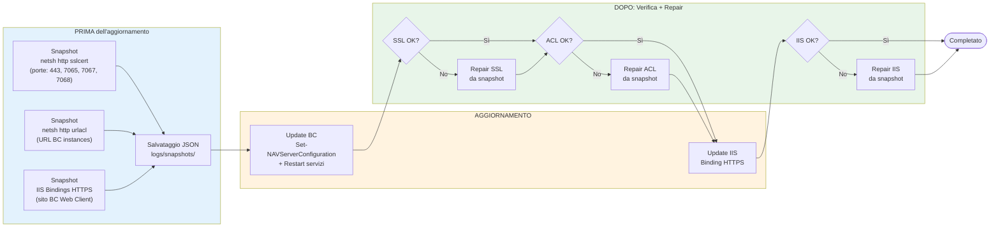
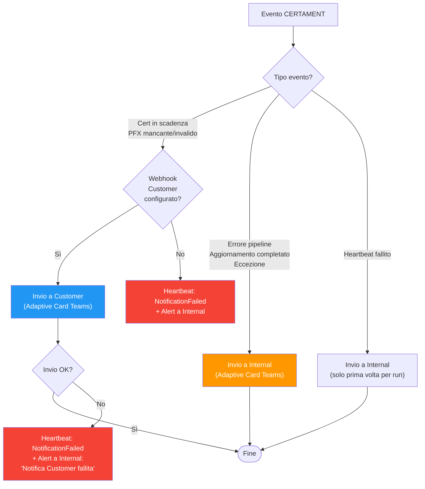
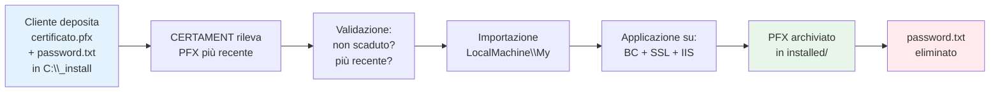

# CERTAMENT — Diagramma di Flusso

## Flusso principale di esecuzione

```mermaid
flowchart TD
    START([CERTAMENT Avvio]) --> ADMIN{Privilegi Admin?}
    ADMIN -->|No| ELEVATE[Rilancio con elevazione] --> END_EXIT([Uscita])
    ADMIN -->|Sì| MUTEX{Mutex libero?}
    MUTEX -->|No| END_ALREADY([Altra istanza attiva - Uscita])
    MUTEX -->|Sì| CONFIG[Carica config.json]
    CONFIG --> LOG[Inizializza logging + pulizia log vecchi]
    LOG --> BCMOD[Importa modulo BC Management]
    BCMOD --> MODULES[Importa moduli CERTAMENT]
    MODULES --> HB_START[/Heartbeat: Started/]

    HB_START --> STEP1["[1] Lettura certificati BC<br/>Get-BCThumbprint"]
    STEP1 --> HAS_CERTS{Certificati trovati?}
    HAS_CERTS -->|No| NOTIFY_FAIL1[Notifica errore Internal] --> HB_ERR1[/Heartbeat: Error/] --> END_EXIT

    HAS_CERTS -->|Sì| STEP2["[2] Verifica scadenza<br/>Get-CertDetails per ogni cert"]
    STEP2 --> EXPIRING{Cert in scadenza<br/>entro soglia?}
    EXPIRING -->|No| HB_HEALTHY[/Heartbeat: Healthy/] --> END_OK([Uscita OK])

    EXPIRING -->|Sì| LOOP_START["Per ogni certificato in scadenza..."]

    LOOP_START --> STEP4["[4] Cerca PFX<br/>Get-PfxFile"]
    STEP4 --> HAS_PFX{PFX trovato?}
    HAS_PFX -->|No| NOTIFY_CUST1[Notifica Customer:<br/>Caricare PFX] --> HB_AWAIT1[/Heartbeat: AwaitingPfx/] --> LOOP_NEXT

    HAS_PFX -->|Sì| READ_PWD[Lettura password<br/>password.txt → config fallback]
    READ_PWD --> HAS_PWD{Password OK?}
    HAS_PWD -->|No| NOTIFY_CUST2[Notifica Customer:<br/>Password mancante] --> HB_AWAIT2[/Heartbeat: AwaitingPfx/] --> LOOP_NEXT

    HAS_PWD -->|Sì| VALIDATE_PFX[Validazione PFX:<br/>scaduto? più recente?]
    VALIDATE_PFX --> PFX_VALID{PFX valido<br/>e più recente?}
    PFX_VALID -->|No| NOTIFY_CUST3[Notifica Customer:<br/>PFX non valido] --> HB_AWAIT3[/Heartbeat: AwaitingPfx/] --> LOOP_NEXT

    PFX_VALID -->|Sì| STEP5["[5] Installazione PFX<br/>Install-PfxCert"]
    STEP5 --> INSTALL_OK{Installato?}
    INSTALL_OK -->|No| NOTIFY_FAIL2[Notifica errore Internal] --> LOOP_NEXT

    INSTALL_OK -->|Sì| SNAPSHOT["Snapshot pre-update:<br/>• SSL bindings - netsh sslcert<br/>• URL ACL - netsh urlacl<br/>• Salvataggio su disco JSON"]

    SNAPSHOT --> STEP6["[6] Aggiornamento BC<br/>Update-BCServiceCert + restart"]
    STEP6 --> VERIFY_BC["Verifica post-BC<br/>Test-BCPostUpdate"]
    VERIFY_BC --> BC_OK{BC OK?}
    BC_OK -->|No| RETRY_BC[Retry aggiornamento BC] --> VERIFY_BC2[Seconda verifica]
    BC_OK -->|Sì| SSL_CHECK

    VERIFY_BC2 --> BC_OK2{OK dopo retry?}
    BC_OK2 -->|No| NOTIFY_FAIL3[Notifica errore Internal]
    BC_OK2 -->|Sì| SSL_CHECK

    SSL_CHECK["Verifica SSL bindings<br/>Test-SslCertBindings"]
    SSL_CHECK --> SSL_OK{SSL OK?}
    SSL_OK -->|Sì| URLACL_CHECK
    SSL_OK -->|No| SSL_REPAIR["Repair SSL bindings<br/>da snapshot"]
    SSL_REPAIR --> URLACL_CHECK

    URLACL_CHECK["Verifica URL ACL<br/>Test-UrlAcls"]
    URLACL_CHECK --> ACL_OK{ACL OK?}
    ACL_OK -->|Sì| STEP7
    ACL_OK -->|No| ACL_REPAIR["Repair URL ACL<br/>da snapshot"]
    ACL_REPAIR --> STEP7

    STEP7["[7] Aggiornamento IIS<br/>Update-IISBinding + snapshot"]
    STEP7 --> VERIFY_IIS["Verifica post-IIS<br/>Test-IISPostUpdate"]
    VERIFY_IIS --> IIS_OK{IIS OK?}
    IIS_OK -->|Sì| NOTIFY_SUCCESS
    IIS_OK -->|No| RETRY_IIS[Retry IIS + Repair da snapshot]
    RETRY_IIS --> NOTIFY_SUCCESS

    NOTIFY_SUCCESS[Notifica Internal:<br/>Certificato aggiornato]
    NOTIFY_SUCCESS --> ARCHIVE[Archivia PFX in installed/]
    ARCHIVE --> LOOP_NEXT{Altri certificati?}
    LOOP_NEXT -->|Sì| LOOP_START
    LOOP_NEXT -->|No| CLEANUP[Elimina password.txt]

    CLEANUP --> HB_END[/Heartbeat: Completed/]
    HB_END --> END_OK

    style START fill:#4CAF50,color:white
    style END_OK fill:#4CAF50,color:white
    style END_EXIT fill:#f44336,color:white
    style END_ALREADY fill:#ff9800,color:white
    style NOTIFY_CUST1 fill:#2196F3,color:white
    style NOTIFY_CUST2 fill:#2196F3,color:white
    style NOTIFY_CUST3 fill:#2196F3,color:white
    style NOTIFY_FAIL1 fill:#f44336,color:white
    style NOTIFY_FAIL2 fill:#f44336,color:white
    style NOTIFY_FAIL3 fill:#f44336,color:white
    style NOTIFY_SUCCESS fill:#4CAF50,color:white
    style HB_START fill:#9C27B0,color:white
    style HB_HEALTHY fill:#9C27B0,color:white
    style HB_END fill:#9C27B0,color:white
    style HB_ERR1 fill:#9C27B0,color:white
    style HB_AWAIT1 fill:#9C27B0,color:white
    style HB_AWAIT2 fill:#9C27B0,color:white
    style HB_AWAIT3 fill:#9C27B0,color:white
```

**Legenda colori:**
- **Verde**: Avvio / successo / completamento
- **Rosso**: Errori / uscita con errore
- **Blu**: Notifiche al cliente
- **Viola**: Heartbeat Azure
- **Arancione**: Warning / blocco non critico

---

## Self-healing: tre livelli di protezione SSL

---

## Flusso notifiche

---

## Ciclo di vita del PFX

