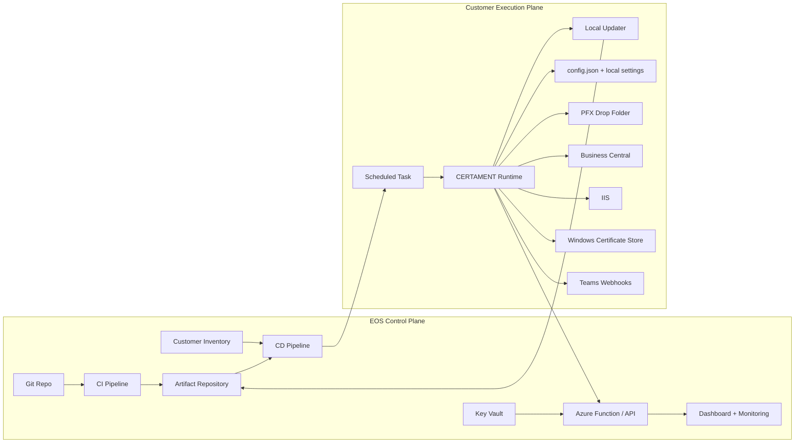

# CERTAMENT — Strategia Runbook e Infrastruttura Target

## Scopo del documento

Questo documento raccoglie le idee architetturali emerse per portare **CERTAMENT** da tool locale installato come **Scheduled Task** a soluzione più strutturata, gestibile su più clienti e monitorata centralmente dal tenant EOS.

L'obiettivo non è forzare una migrazione immediata, ma definire:

1. cosa esiste oggi
2. quali sono i limiti del modello attuale
3. quali opzioni esistono per la conversione a runbook
4. quale infrastruttura mettere intorno al progetto
5. quale percorso è realistico per arrivarci senza far esplodere scope e complessità

---

## Decisioni correnti

Le decisioni architetturali attuali sono queste:

- installazione iniziale **manuale** sul server cliente
- esecuzione **locale** tramite Scheduled Task
- monitoraggio e heartbeat verso il tenant EOS ad ogni esecuzione
- dashboard e alerting centralizzati lato EOS
- aggiornamento codice tramite **self-update controllato a pull**
- `config.json` del cliente mantenuto locale e non sovrascritto ciecamente dagli update
- **Arc, Lighthouse, Azure Automation e Hybrid Worker fuori scope per ora**

Questa è la baseline operativa da considerare come v1 realistica.

---

## Stato attuale

Oggi CERTAMENT è già un prodotto operativo con componenti chiari:

- wizard di installazione interattivo
- `config.json` per server/cliente
- orchestratore principale (`_MAINCertManager.ps1`)
- moduli separati per PFX, certificati, BC, IIS, notifiche, test web service
- Scheduled Task locale giornaliera
- notifiche Teams Customer/Internal
- heartbeat Azure
- diagnostica post-installazione

### Punti di forza del modello attuale

- semplice da capire
- gira vicino alle risorse reali da aggiornare
- non dipende da Azure per funzionare
- adatto a server on-prem o VM cliente
- basso effort operativo iniziale

### Limiti del modello attuale

- deployment manuale o semi-manuale cliente per cliente
- difficile avere versioning centralizzato su larga scala
- difficile fare rollout controllati a ring
- governance distribuita su più server
- codice PowerShell presente sul server cliente
- monitoraggio e inventory ancora artigianali

---

## Perché la conversione a runbook non è banale

CERTAMENT non è un semplice script che chiama API cloud. Tocca risorse locali critiche:

- store certificati Windows (`LocalMachine\My`)
- servizi Business Central
- configurazione istanze BC
- binding IIS
- `netsh http sslcert`
- `netsh http urlacl`
- file system locale (`C:\_install`, log, snapshot)

Quindi il problema non è solo “spostare lo script in Azure”.

Il vero problema è: **come eseguire in modo sicuro e affidabile logica locale dentro ambienti cliente mantenendo controllo centralizzato**.

---

## Vincoli architetturali reali

### 1. Il contesto di esecuzione deve essere locale

Per aggiornare BC, IIS e certificati, l'esecuzione deve avvenire su un worker che vede il server locale del cliente.

### 2. Lighthouse non sostituisce l'esecuzione locale

**Azure Lighthouse** delega la gestione delle risorse Azure, ma non trasforma un runbook nel tenant EOS in un processo con accesso diretto a BC/IIS dentro il server del cliente.

### 3. Un vero “runbook unico nel tenant EOS per tutti i clienti” non è realistico

È realistico come **orchestratore centrale**, non come **motore che esegue direttamente tutta la pipeline tecnica**.

### 4. Se pubblichi tutto il codice nel tenant del cliente, il codice è leggibile

Questo non significa che il progetto perde valore, ma è un rischio reale di IP leakage. Va gestito a livello architetturale e contrattuale.

---

## Opzioni architetturali

## Opzione A — Modello attuale migliorato

### Descrizione

CERTAMENT rimane installato come Scheduled Task locale per cliente/server, ma viene circondato da infrastruttura moderna:

- CI
- packaging versionato
- CD controllato
- inventory clienti
- rollout a ring
- heartbeat centralizzato
- dashboard operativa

### Pro

- sforzo basso
- nessuna rivoluzione tecnica
- massima compatibilità con installazioni reali
- rischio ridotto
- tempo di adozione rapido

### Contro

- deployment engine ancora esterno al server
- logica completa visibile sul server cliente
- meno elegante dal punto di vista cloud-native

### Quando sceglierla

È la scelta migliore se l'obiettivo è passare da “tool funzionante” a “servizio gestibile” senza riscrivere mezzo prodotto.

---

## Opzione B — Runbook per cliente con Hybrid Worker

### Descrizione

Ogni cliente ha nel proprio tenant o subscription:

- Azure Automation Account
- Hybrid Runbook Worker
- eventualmente Key Vault
- eventualmente Storage / Log Analytics

Il runbook viene invocato da Azure Automation ma gira di fatto sul worker con accesso locale al server.

### Pro

- approccio enterprise pulito
- scheduling e orchestrazione Azure-native
- logging più strutturato
- integrazione più facile con governance Azure

### Contro

- molto più complesso da distribuire
- costo operativo per cliente
- onboarding lungo
- devi gestire identità, worker, networking, permessi, drift
- se distribuisci il runbook completo, il codice è comunque nel perimetro cliente

### Quando sceglierla

Ha senso solo quando hai davvero bisogno di scala Azure-first e i clienti sono già maturi su Arc / Azure Automation.

---

## Opzione C — Control Plane centrale + Thin Executor cliente

### Descrizione

È il modello più solido nel medio termine.

Nel tenant EOS tieni il **brain**:

- API / Azure Function / App Service
- motore decisionale
- policy di rollout
- inventory clienti
- dashboard e monitoraggio
- artifact repository
- release management

Nel server o tenant cliente tieni solo il **thin executor**:

- riceve istruzioni
- scarica o riceve manifest firmati
- esegue operazioni locali
- restituisce stato ed evidenze

### Pro

- protegge meglio l'IP
- centralizza la logica di orchestrazione
- separa controllo da esecuzione
- è il modello più adatto a un MSP

### Contro

- richiede refactoring del progetto
- servono API sicure, token, manifest, protocollo di esecuzione
- aumenta molto il lavoro di design

### Quando sceglierla

Quando CERTAMENT smette di essere solo “script locale” e diventa davvero una piattaforma gestita.

---

## Raccomandazione pratica

### Breve termine

Adottare **Opzione A**.

### Medio termine

Rafforzare il modello locale con:

- inventory clienti
- artifact repository
- dashboard heartbeat
- self-update controllato
- rollback automatico di versione

### Lungo termine

Valutare una vera evoluzione verso **Opzione C** solo se il numero di clienti, il valore IP e la necessità di governo centralizzato lo giustificano davvero.

---

## Architettura target consigliata

## Livello 1 — Control Plane EOS

Componenti consigliati nel tenant/provider EOS:

| Componente | Ruolo |
|---|---|
| Git repository | sorgente, review, versioning |
| CI pipeline | lint, test, package, firma |
| Artifact repository | zip/versioni firmate di CERTAMENT |
| Release manifest | mappa versione -> clienti/ring |
| Inventory clienti | elenco server, tenant, ring, stato, owner |
| Dashboard operativa | stato heartbeat, versioni, errori, scadenze |
| Azure Function / API | ingest heartbeat + risposta desired state |
| Log Analytics / App Insights / Table Storage | telemetria e query operative |
| Key Vault | secret lato provider |

## Livello 2 — Customer Execution Plane

Per ogni cliente o ambiente:

| Componente | Ruolo |
|---|---|
| Server BC/IIS | target reale degli update |
| Scheduled Task | esecuzione locale |
| Config locale | path PFX, sito IIS, heartbeat, webhook |
| Secret locale | password, token, credenziali eventuali |
| Log locale | troubleshooting sul server |
| Channel Teams Customer/Internal | notifica operativa |
| Updater locale | download artifact, backup, replace, rollback |

## Livello 3 — Governance multi-tenant

Componenti opzionali per una fase futura, non inclusi nel piano corrente:

| Componente | Ruolo |
|---|---|
| Azure Arc | onboarding server cliente in governance centralizzata |
| Azure Lighthouse | delega amministrativa cross-tenant |
| Automation Account per cliente | scheduling cloud-native |
| Hybrid Runbook Worker | esecuzione reale sul server |
| Policy / tagging standard | normalizzazione ambienti |

---

## Diagramma architetturale



Il diagramma rappresenta il modello pragmatico consigliato:

- control plane centralizzato lato EOS
- esecuzione locale vicino alle risorse reali del cliente
- artifact e inventory come base del deployment
- osservabilita' centralizzata senza spostare subito tutta la logica in Azure Automation
- update deciso da EOS ma applicato localmente dal server via pull HTTPS

---

## Cosa mettere intorno al progetto

## 1. Source Control e branching

Minimo consigliato:

- branch `main` o `release` stabile
- branch di feature corte
- pull request obbligatoria per modifiche strutturali
- version tag ad ogni rilascio

### Obiettivo

Sapere sempre quale versione è in produzione e dove.

---

## 2. CI — Continuous Integration

Ogni push o PR dovrebbe eseguire:

1. validazione sintassi PowerShell
2. `PSScriptAnalyzer`
3. test Pester
4. packaging artifact
5. firma script o artifact se adottata

### Output atteso della CI

- zip versionato di CERTAMENT
- changelog o release notes minime
- numero versione
- esito test

---

## 3. CD — Continuous Delivery / Deployment

La CD deve sapere:

- quali clienti esistono
- quali server hanno CERTAMENT attivo
- quale ring appartiene a ciascun cliente
- quale versione è installata
- come distribuire rollback o update

### Meccanismo consigliato

- Ring 0: laboratorio interno EOS
- Ring 1: 1 cliente pilota
- Ring 2: piccolo gruppo controllato
- Ring 3: rollout largo

### Regola fondamentale

Mai deployare a tutti insieme.

### Decisione attuale

Nel piano corrente la CD gestisce soprattutto:

- pubblicazione artifact
- definizione target version
- controllo per ring
- monitoraggio rollout

L'aggiornamento sul server viene applicato dal runtime locale tramite self-update controllato, non tramite push remoto pesante.

---

## 4. Inventory clienti

Serve un inventario centralizzato, anche solo JSON o CSV nella prima fase.

Campi minimi consigliati:

- customerId
- customerName
- tenantId
- subscriptionId
- environmentType
- serverName
- executionMode
- ring
- installedVersion
- targetVersion
- enabled
- owner
- lastHeartbeat
- notes

### Uso dell'inventory

- decidere dove distribuire
- sapere cosa gira in produzione
- filtrare per ring o per cliente
- alimentare dashboard e report

---

## 5. Packaging standard

CERTAMENT dovrebbe essere distribuito come artifact coerente:

- zip con file runtime
- eventuale script di bootstrap/update
- metadata di versione
- hash o firma

### Beneficio

Il deploy non dipende più dal “copio la cartella a mano”.

Il package standard diventa anche la base del self-update remoto a pull.

---

## 6. Signing e trust

Se il prodotto cresce, conviene introdurre:

- code signing certificate
- verifica firma in fase di deploy
- enforcement della provenienza artifact

### Perché serve

- riduce rischio di manomissione
- aumenta fiducia operativa
- prepara il prodotto a contesti enterprise più rigidi

---

## 7. Observability e monitoraggio

Oggi esiste già l'heartbeat. È una base ottima.

La parte da costruire intorno è:

- endpoint centrale robusto
- persistenza stato heartbeat
- dashboard per ultimo stato per server
- alert su assenza heartbeat
- alert su errori ripetuti
- query per versioni installate
- query per certificati prossimi a scadenza

### Dashboard minima utile

Una riga per server con:

- cliente
- server
- ultima esecuzione
- stato ultimo heartbeat
- versione CERTAMENT
- cert next expiry
- ultima azione

---

## 8. Secrets management

Nel modello attuale i segreti sono per lo più locali.

Possibili evoluzioni:

- `password.txt` rimane modello semplice per il PFX del cliente
- token heartbeat o API in Windows Credential Manager / DPAPI
- Key Vault solo quando esiste una reale integrazione Azure consolidata

### Nota pratica

Non introdurre Key Vault solo per moda. Se il server è on-prem, la catena di autenticazione può complicarsi molto più del beneficio ottenuto.

---

## 9. Sicurezza e protezione IP

Questo è uno dei motivi principali per non spingere troppo presto tutto il codice nel tenant cliente.

### Rischi

- il cliente vede gli script
- il cliente può copiarli
- il cliente può modificarli
- il cliente può far girare versioni non supportate

### Mitigazioni possibili

- contratti e clausole di utilizzo
- artifact firmati
- versioni compilate o offuscate solo dove utile
- logica sensibile spostata nel control plane EOS
- executor cliente il più sottile possibile
- validazione online licenza / token / manifest

### Punto chiave

Se l'IP è un tema forte, la risposta non è “mettere tutto in runbook”.

La risposta è **separare la logica di valore dalla parte esecutiva locale**.

---

## 10. Disaster recovery e rollback

Qualunque infrastruttura intorno a CERTAMENT deve prevedere rollback.

Minimo consigliato:

- artifact precedente sempre disponibile
- script di rollback versione
- snapshot dei binding già presenti
- possibilità di reimpostare vecchio thumbprint BC/IIS se necessario
- log e prove del deploy

Nel modello attuale il rollback deve essere eseguibile dal server stesso dopo un self-update fallito.

---

## Modello operativo deciso

La forma approvata oggi per CERTAMENT è questa:

1. installazione iniziale manuale
2. Scheduled Task locale come motore di esecuzione
3. heartbeat e monitoraggio centralizzati verso EOS
4. risposta Azure con desired state o target version
5. self-update locale a pull quando necessario
6. backup e rollback automatico se l'update fallisce

Questo modello copre il bisogno reale di oggi senza introdurre Arc, Lighthouse o Runbook per cliente.

---

## Conversione del progetto a runbook

## Obiettivo della conversione

Separare chiaramente:

1. logica di orchestrazione
2. logica di esecuzione locale
3. ingressi/uscite standardizzati

## Refactoring consigliato

### Fase 1 — Isolare il core logico

Estrarre il più possibile la logica da `_MAINCertManager.ps1` in funzioni/moduli idempotenti:

- input chiari
- output strutturati
- minore dipendenza da `Write-Host`
- esiti machine-readable

### Fase 2 — Introdurre un modello di risultato standard

Ogni esecuzione dovrebbe produrre un oggetto tipo:

- status
- stage
- changed
- warnings
- errors
- customer
- server
- version
- evidences

Questo aiuta sia in runbook sia in CI/CD sia in dashboard.

### Fase 3 — Separare il wrapper di esecuzione

Creare tre possibili wrapper attorno allo stesso core:

- wrapper Scheduled Task locale
- wrapper Runbook / Hybrid Worker
- wrapper thin executor remoto

### Fase 4 — Rendere la config più trasportabile

Separare:

- config cliente stabile
- parametri runtime
- secret runtime
- metadata di deployment

### Fase 5 — Preparare il prodotto a esecuzione remota controllata

Serve ridurre dipendenze implicite:

- path hardcoded
- interazione console obbligatoria
- side effects non tracciati
- output solo visuali

---

## Evoluzioni future possibili

Le varianti runbook restano possibili, ma non fanno parte del piano corrente.

## Come apparirebbe il modello Runbook reale

## Variante 1 — Runbook pieno nel cliente

Flusso:

1. Azure Automation schedula
2. Hybrid Worker esegue CERTAMENT completo
3. il worker tocca BC/IIS/cert store
4. log e heartbeat tornano al control plane

### Valutazione

Tecnologicamente fattibile, ma molto pesante come governance e poco efficace per proteggere l'IP.

## Variante 2 — Runbook leggero + artifact runtime

Flusso:

1. Runbook scarica artifact firmato
2. valida hash/firma
3. esegue wrapper locale
4. raccoglie output strutturato
5. pubblica esito

### Valutazione

Meglio della Variante 1, ma il codice runtime arriva comunque nel perimetro cliente.

## Variante 3 — Runbook/thin executor + brain centrale

Flusso:

1. il worker chiede istruzioni al control plane EOS
2. riceve un manifest firmato con azioni consentite
3. esegue moduli locali minimi
4. invia telemetria e stato
5. il control plane decide i passaggi successivi

### Valutazione

È il modello più forte, ma richiede vera evoluzione di prodotto.

---

## Infrastruttura Azure possibile intorno a CERTAMENT

## Livello minimo

- Git repo
- pipeline CI
- pipeline CD
- artifact storage
- heartbeat endpoint
- dashboard semplice

## Livello intermedio

- Azure Function per ingest heartbeat
- Table Storage o Log Analytics
- inventory clienti centralizzato
- release manifest
- approvazioni manuali per ring

## Livello avanzato

Questa sezione è intenzionalmente fuori scope per la fase corrente.

- Arc onboarding server cliente
- Lighthouse per delega cross-tenant
- Automation Account / Hybrid Worker per cliente
- Key Vault e managed identity
- API centrali di orchestrazione

---

## Piattaforme e componenti possibili

| Area | Opzione semplice | Opzione enterprise |
|---|---|---|
| Repo | GitHub | Azure DevOps Repos |
| CI/CD | GitHub Actions | Azure DevOps Pipelines |
| Artifact | file share / release zip | Azure Artifacts / Storage |
| Inventory | JSON in repo | DB / Table Storage / CMDB |
| Monitoraggio | heartbeat custom | Log Analytics + dashboards |
| Secrets | file locale / DPAPI | Key Vault |
| Fleet mgmt | manuale + self-update pull | Arc + Lighthouse |

---

## CI/CD proposta per CERTAMENT

## Pipeline CI

Trigger:

- push su branch controllati
- pull request

Step:

1. checkout
2. validazione sintassi PowerShell
3. `PSScriptAnalyzer`
4. Pester
5. packaging ZIP
6. publish artifact
7. opzionale firma

## Pipeline CD

Input:

- artifact versionato
- customer manifest
- ring target

Step:

1. selezione clienti target
2. deploy Ring 0
3. smoke test
4. approvazione o auto-promozione
5. deploy Ring 1
6. smoke test
7. deploy Ring 2/3
8. stop automatico se fallimenti sopra soglia

Nel modello attuale, il deploy centrale pubblica artifact e target version; l'aggiornamento del server viene eseguito localmente via self-update.

---

## Customer manifest suggerito

Esempio concettuale di campi:

```json
[
  {
    "customerId": "contoso-prod",
    "customerName": "Contoso",
    "serverName": "BC-PROD-01",
    "environmentType": "production",
    "executionMode": "scheduled-task",
    "ring": 1,
    "enabled": true,
    "installedVersion": "1.0.0",
    "targetVersion": "1.1.0"
  }
]
```

---

## Piano realistico a fasi

## Fase 0 — Stabilizzare il prodotto locale

Durata stimata: bassa

Fare bene:

- version tracking
- test Pester minimi
- CI base
- artifact ZIP
- inventory iniziale

### Obiettivo

Prodotto affidabile e distribuibile.

## Fase 1 — Professionalizzare il deployment

Durata stimata: media

Fare:

- CD verso pochi server
- manifest clienti
- rollout a ring
- dashboard heartbeat
- self-update controllato
- rollback artifact

### Obiettivo

Gestione centralizzata senza cambiare motore di esecuzione.

## Fase 2 — Consolidare il modello locale gestito

Durata stimata: media-alta

Fare:

- scegliere un solo cliente pilota
- validare heartbeat + dashboard in produzione
- validare self-update e rollback su ring pilota
- misurare affidabilità reale del modello locale gestito

### Obiettivo

Confermare che il modello locale gestito copre il bisogno reale senza infrastruttura Azure avanzata.

## Fase 3 — Thin executor / brain separation

Durata stimata: alta

Fare:

- definire protocollo di comando
- centralizzare policy e orchestrazione
- ridurre logica sensibile lato cliente
- introdurre manifest firmati / token

### Obiettivo

Evoluzione da script gestito a piattaforma MSP.

---

## Cosa NON fare subito

- non partire da Arc, Lighthouse, Automation e Key Vault tutti insieme
- non introdurre Arc e Lighthouse nella fase corrente
- non riscrivere tutto in funzione di Azure prima di avere CI/CD e inventory
- non costruire un control plane complesso senza prima validare i casi reali su 1 cliente pilota
- non confondere “enterprise-looking” con “più utile”

---

## Decisione consigliata per oggi

Se l'obiettivo è far crescere CERTAMENT in modo sano:

1. mantenere il runtime locale attuale
2. costruire intorno CI/CD, artifact, inventory, dashboard
3. aggiungere self-update controllato con rollback
4. tenere Arc, Lighthouse e Runbook fuori scope fino a nuovo bisogno reale

---

## Conclusione

CERTAMENT non ha bisogno immediato di diventare un runbook per essere un progetto serio.

Ha bisogno prima di diventare:

- versionato
- testato
- distribuibile
- osservabile
- governabile

La conversione a runbook è una possibile evoluzione, non il punto di partenza obbligatorio.

La traiettoria più pragmatica è:

1. consolidare il modello locale
2. aggiungere infrastruttura di delivery e monitoraggio
3. pilotare la parte Azure su scala minima
4. solo dopo valutare la piattaforma multi-tenant completa